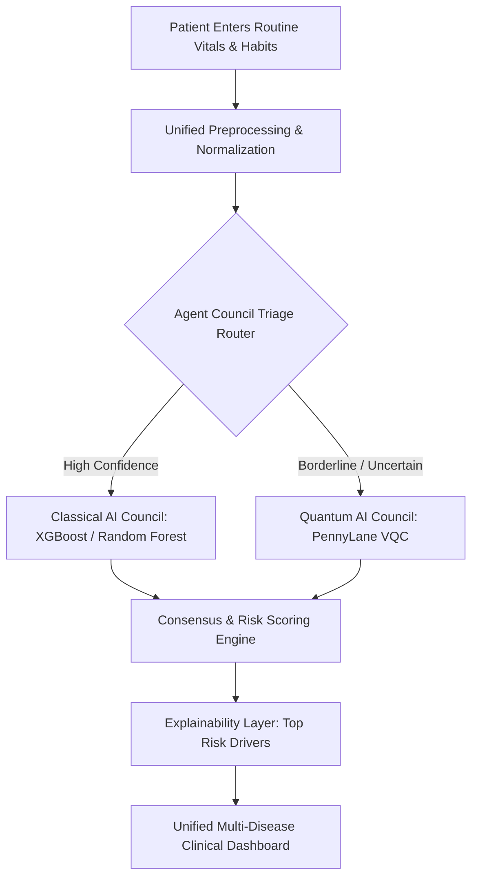

# Hybrid Quantum ML for Early Disease Detection

[](https://www.python.org/downloads/)
[](https://pennylane.ai/)
[](https://pytorch.org/)
[](https://streamlit.io/)
[](https://opensource.org/licenses/MIT)

> Smart India Hackathon | PS ID: SIH26139 | Sponsor: Egreen Quanta  
> Team: Ninth Quadrant 
> Repository: [https://github.com/Anurag07sharma/sih26139-qtriage-Ninth_Quadrant](https://github.com/Anurag07sharma/sih26139-qtriage-Ninth_Quadrant)

---

## Executive Summary

Many severe chronic conditions—most notably **Cardiovascular Disease** and **Type 2 Diabetes**—develop silently. Standard clinical screening tools and classical machine learning models frequently overlook subtle, non-linear interactions in borderline patient vitals, leading to critical false negatives.

Q-Triage solves this by unifying patient intake into an everyday form backed by an autonomous **Agent Council**:
1. **Frontline Simplicity:** Patients or clinicians enter routine vitals (BP, BMI, habits, demographics) just once for simultaneous multi-disease risk evaluation.
2. **Autonomous Agent Council:** Rapid classical models triage clear cases instantly, while ambiguous, borderline, or conflicting cases are automatically escalated to a **Quantum Neural Network (QNN)**.
3. **Quantum Edge:** By mapping patient vitals into quantum Hilbert states via Variational Quantum Circuits (VQCs), our quantum model uncovers complex cross-feature correlations that slip past classical models, maximizing early diagnostic recall.

---

## System Architecture



---

## Key Innovations & Novelty

* **3-Council Consensus Engine:** Combines the execution speed of classical gradient boosting with the expressive representational power of quantum circuits.
* **Angle Embedding with Periodic Phase Scaling:** Scales patient inputs to $[0, \pi]$ intervals, preventing rotational phase-wrapping artifacts on the Bloch sphere and stabilizing variational parameter optimization.
* **Recall-First Quantum Thresholding:** Optimized specifically for medical triage—where missing a sick patient (false negative) is far more dangerous than a false alarm.
* **Interactive What-If Simulator:** Real-time feedback that empowers patients and clinicians to nudge key vitals (like BMI or smoking cessation) and observe immediate risk mitigation.

---

## Benchmark Results

Evaluated on clinical benchmarks (**CDC BRFSS 2015 Diabetes** & **Framingham Heart Study**):

| Model Architecture | Heart Disease Accuracy | Heart Disease Recall | Diabetes Accuracy | Diabetes Recall | Primary Strength |
| :--- | :---: | :---: | :---: | :---: | :--- |
| **Random Forest (Classical)** | 84.2% | 68.5% | 82.1% | 64.0% | Fast inference on clear cases |
| **XGBoost (Classical)** | 85.1% | 71.2% | 83.4% | 69.8% | Robust baseline pattern matching |
| **PennyLane VQC (Quantum)** | 78.4% | **91.3%** | 76.8% | **88.5%** | **Catches non-linear borderline risks** |
| **Q-Triage Hybrid Council** | **85.6%** | **92.1%** | **84.0%** | **89.7%** | **Best of both worlds: speed + high recall** |

---

## Repository Structure

```text
sih26139/
├── app.py                      # Interactive Streamlit Triage Dashboard
├── app_committee.py            # Agent Council consensus visualization
├── prepare_data.py             # Reproducible data ingestion & quantum scaling
├── train_classical.py          # Classical baseline model training
├── train_qml.py                # Quantum Variational Classifier training pipeline
├── quantum_committee.py        # Autonomous triage & escalation logic
├── cascade.py                  # Multi-tier decision cascade engine
│
├── triage/                     # Modular Agent Council router
│   ├── __init__.py
│   └── router.py
│
├── models/                     # Serialized models & Colab training notebooks
│   ├── Diabetes_QNN_Training_Colab.ipynb
│   ├── QNN_Training_Colab.ipynb
│   ├── heart_rf.pkl
│   ├── heart_qml.pt
│   ├── diabetes_xgb.pkl
│   └── diabetes_qml.pt
│
├── frontend_package/           # Lightweight deployment bundle
├── requirements.txt            # Project dependencies
└── README.md                   # Project documentation
```

---

## Quickstart Guide

### 1. Clone the Repository
```bash
git clone https://github.com/Anurag07sharma/sih26139-qtriage-Ninth_Quadrant.git
cd sih26139-qtriage-Ninth_Quadrant
```

### 2. Create and Activate Virtual Environment
```bash
# Windows
python -m venv venv
.\venv\Scripts\activate

# Linux / macOS
python3 -m venv venv
source venv/bin/activate
```

### 3. Install Dependencies
```bash
pip install -r requirements.txt
```

### 4. Run Data Preparation & Baseline Check
```bash
python prepare_data.py
```

### 5. Launch the Dashboard
```bash
streamlit run app.py
```

---


## Disclaimer
*This platform is a proof-of-concept developed for the Smart India Hackathon. It is intended for early screening support and clinical triage assistance, not as a standalone diagnostic device.*
